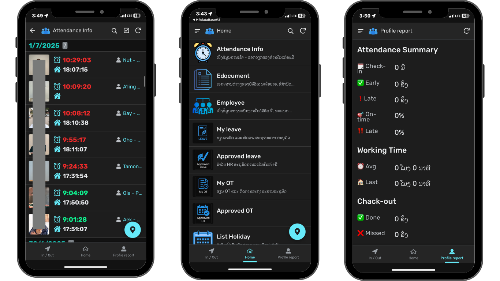

# 📱 HR Management System

A modern mobile-friendly HR management system built with **AppSheet** and **Google Sheets**, designed to simplify attendance tracking, leave and OT approvals, employee records, and document sharing for any organization.

---

## 🖼️ App Screenshot

> *Replace this image with your actual app screenshot. Make sure the image is stored in the `images/` folder next to your README.md file.*

---

## ✅ Key Features

- 🔒 Secure personal login for each employee
- 📍 GPS-based Check-in/Check-out (within 200 meters)
- 📅 Leave request and approval system
- ⏱️ OT (Overtime) request with reason and approval
- 🧾 Monthly profile reports for employees
- 📂 Document center for company policies (E-Document)
- 🗓️ National and company holiday calendar
- 👩‍💼 Admin dashboard for full employee management

---

## 📁 Pages in the App

| Page Name         | Description                                             |
|-------------------|---------------------------------------------------------|
| **In/Out**        | GPS-based daily check-in/check-out                      |
| **Attendance Info** | Daily time tracking logs                              |
| **My Leave**      | Submit leave requests (sick leave, personal, vacation)  |
| **Approved Leave**| Leave requests approved by supervisors                  |
| **My OT**         | Submit overtime request with reason                     |
| **Approved OT**   | Approved overtime records                               |
| **Edocument**     | Company documents and policies                          |
| **List Holiday**  | National holidays list                                  |
| **View Holiday**  | Company-specific holiday calendar                       |
| **Employee**      | Employee profile page (self-editable fields)            |
| **Report Profile**| Monthly summary of employee activity and records        |

---
